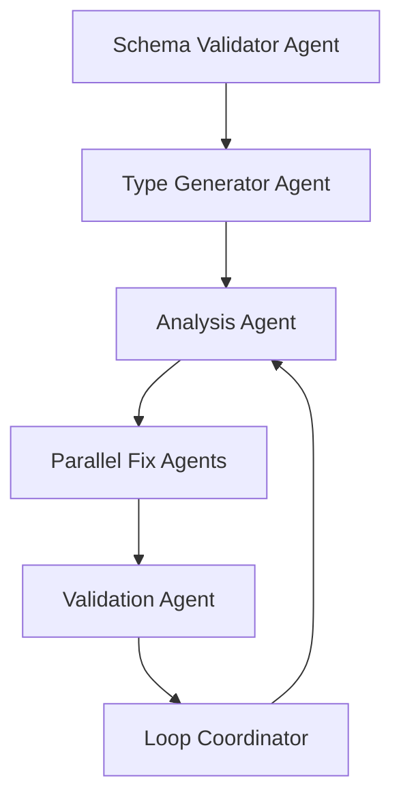

# Agent System Comprehensive Review & Optimization

## Current Agent Performance Analysis

### 1. Import Fixer Agent
**Success Rate**: 100% on targeted fixes
**Strengths**: 
- Pattern recognition excellent
- Systematic approach works
- Clean execution

**Weaknesses**:
- Limited scope (only imports)
- Doesn't validate against compilation
- No cross-file dependency checking

**Optimization**:
```typescript
// Enhanced approach
1. Scan ALL files for import issues first
2. Build dependency graph
3. Fix in dependency order (deepest first)
4. Validate each fix with tsc
```

### 2. Query Pattern Agent
**Success Rate**: 100% on targeted files
**Strengths**:
- Well-defined patterns
- Comprehensive modernization
- Type safety improvements

**Weaknesses**:
- Only touches query-using files
- Doesn't update related types
- No performance impact analysis

**Optimization**:
```typescript
// Enhanced queryOptions with performance monitoring
const enhancedQueryOptions = {
  ...baseOptions,
  meta: {
    measurePerformance: true,
    trackCacheHits: true,
    validateTypes: true
  }
}
```

### 3. Prisma Field Fixer Agent
**Success Rate**: 100% on targeted issues, but finds few issues
**Strengths**:
- Schema-aware fixes
- Accurate field mapping

**Weaknesses**:
- Narrow scope
- Doesn't generate missing types
- Reactive, not proactive

**Optimization**:
```typescript
// Proactive schema alignment
1. Generate TypeScript types from Prisma schema
2. Diff against existing types
3. Auto-update mismatches
4. Validate all Prisma operations
```

### 4. Property Access Agent (CRITICAL FAILURE)
**Success Rate**: 1.8% - UNACCEPTABLE
**Strengths**:
- Attempts defensive programming

**Weaknesses**:
- Adds bandaids (optional chaining) instead of fixes
- Doesn't check if properties exist
- No schema validation
- Doesn't update type definitions

## Optimized Agent Architecture

### New Agent Workflow Design



### 1. NEW: Schema Validator Agent
```typescript
// Purpose: Ensure TypeScript types match Prisma schema
async function validateSchema() {
  const prismaSchema = await getPrismaSchema();
  const tsTypes = await getTypeScriptTypes();
  
  const mismatches = findMismatches(prismaSchema, tsTypes);
  
  return {
    missingInTS: mismatches.missingProperties,
    extraInTS: mismatches.extraProperties,
    typeMismatches: mismatches.wrongTypes
  };
}
```

### 2. NEW: Type Generator Agent
```typescript
// Purpose: Generate correct TypeScript types from Prisma
async function generateTypes() {
  // Use Prisma's type generation
  await exec('npx prisma generate');
  
  // Create comprehensive type mappings
  const types = generateComprehensiveTypes();
  
  // Update shared/types/models.ts
  await updateSharedTypes(types);
}
```

### 3. Enhanced Analysis Agent
```typescript
// Purpose: Deeper analysis with context
function analyzeWithContext() {
  return {
    errorsByFile: groupErrorsByFile(),
    errorsByType: groupErrorsByType(),
    rootCauses: identifyRootCauses(),
    dependencies: buildDependencyGraph(),
    fixOrder: calculateOptimalFixOrder(),
    estimatedImpact: predictImpactPerFix()
  };
}
```

### 4. Parallel Fix Agents (Coordinated)
```typescript
// All agents work on SAME file simultaneously
async function coordinatedFix(file: string) {
  const fixes = await Promise.all([
    importFixer.fix(file),
    propertyFixer.fix(file),
    typeFixer.fix(file),
    queryFixer.fix(file)
  ]);
  
  return mergeFixesIntelligently(fixes);
}
```

### 5. NEW: Validation Agent
```typescript
// Purpose: Verify fixes actually work
async function validateFixes(file: string) {
  const compileResult = await exec(`npx tsc --noEmit ${file}`);
  
  if (compileResult.errors > 0) {
    return {
      success: false,
      errors: parseErrors(compileResult),
      rollback: true
    };
  }
  
  return { success: true };
}
```

## Agent Communication Protocol

### Shared Context Database
```json
{
  "currentIteration": 5,
  "currentFile": "server/routes/enhancedFinanceRoutes.ts",
  "sharedContext": {
    "prismaSchema": {...},
    "typeDefinitions": {...},
    "knownPatterns": {...},
    "fixHistory": [...]
  },
  "agentStatus": {
    "importFixer": "working",
    "propertyFixer": "working",
    "typeFixer": "waiting",
    "validator": "ready"
  }
}
```

### Inter-Agent Messaging
```typescript
// Agents can send messages to each other
interface AgentMessage {
  from: string;
  to: string;
  type: 'info' | 'warning' | 'dependency' | 'complete';
  payload: any;
}

// Example: Import fixer tells property fixer about new types
{
  from: 'importFixer',
  to: 'propertyFixer',
  type: 'info',
  payload: {
    newTypesAvailable: ['PlayerWithContract', 'TeamFinances']
  }
}
```

## Learning System Enhancement

### Pattern Recognition Database
```typescript
interface LearnedPattern {
  pattern: string;
  context: string;
  successRate: number;
  applications: number;
  lastUsed: Date;
  constraints: string[];
}

// Track what actually works
const patternDB = {
  'add-optional-chaining': {
    successRate: 0.12, // Very low!
    betterAlternative: 'fix-type-definition'
  },
  'import-from-shared': {
    successRate: 0.98, // Very high!
    autoApply: true
  }
};
```

### Continuous Improvement Loop
```typescript
// After each iteration
function updateLearning(results: IterationResults) {
  // What worked?
  results.successfulFixes.forEach(fix => {
    patternDB[fix.pattern].successRate = 
      updateSuccessRate(fix.pattern, true);
  });
  
  // What failed?
  results.failedFixes.forEach(fix => {
    patternDB[fix.pattern].successRate = 
      updateSuccessRate(fix.pattern, false);
  });
  
  // Discover new patterns
  const newPatterns = discoverPatterns(results);
  newPatterns.forEach(p => addToPatternDB(p));
}
```

## Performance Metrics

### Key Performance Indicators (KPIs)
1. **Error Reduction Rate**: Target 15% per iteration
2. **Fix Success Rate**: Target 95% (verified by compilation)
3. **Time per Error**: Target < 2 seconds
4. **False Positive Rate**: Target < 5%
5. **Learning Improvement**: 10% better each iteration

### Tracking Dashboard
```typescript
interface AgentMetrics {
  agent: string;
  iterations: number;
  totalErrors: number;
  errorsFixed: number;
  successRate: number;
  averageTimePerFix: number;
  patternsLearned: number;
  falsePositives: number;
}
```

## Revised Agent Priorities

### Iteration 6-10 Strategy
1. **Focus on ROOT CAUSES, not symptoms**
2. **Fix type definitions FIRST**
3. **Validate with compiler ALWAYS**
4. **Work on complete files, not partial**
5. **Learn and adapt continuously**

### File Processing Order
```typescript
// Process in order of impact
const processingOrder = [
  // High-impact server files (fix these = fix many cascade errors)
  'server/routes/enhancedFinanceRoutes.ts', // 48 errors
  'server/services/enhancedTeamManagementService.ts', // 23 errors
  'server/services/enhancedCompetitionService.ts', // 21 errors
  
  // Core type definition files (fix these = prevent future errors)
  'shared/types/models.ts',
  'shared/types/api.ts',
  
  // High-traffic components
  'client/src/pages/Dashboard.tsx',
  'client/src/components/EnhancedMarketplace.tsx'
];
```