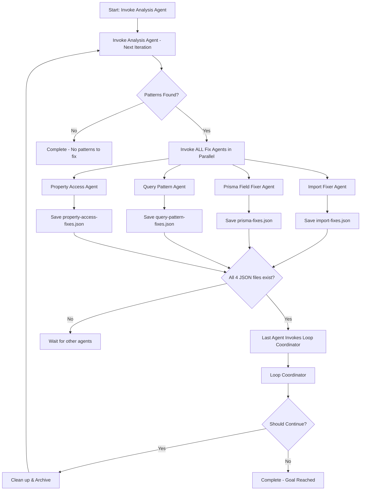

# TypeScript Migration Loop - Orchestration Guide

## 🔄 Automated Loop Architecture

This document explains how the TypeScript migration agents work together in an automated, self-orchestrating loop.

## Flow Diagram



## How The Orchestration Works

### 1. Starting the Loop

To start the entire automated loop, you only need to invoke the Analysis Agent once:

```bash
# Manual start - only needed once
Task: {
  subagent_type: "typescript-analysis-agent",
  description: "Start TypeScript migration",
  prompt: "Analyze TypeScript errors and start the migration loop. This is iteration 1."
}
```

### 2. Analysis Agent Actions

The Analysis Agent:
1. Analyzes all TypeScript errors
2. Categorizes them into patterns
3. Saves results to `.claude/agents/analysis-results.json`
4. **Automatically invokes ALL applicable fix agents in parallel**

### 3. Parallel Fix Agent Execution

All fix agents run simultaneously:
- Each reads from `analysis-results.json`
- Each fixes their specific pattern type
- Each saves results to their own JSON file
- **The LAST agent to complete invokes the Loop Coordinator**

### 4. Loop Coordinator Decision

The Loop Coordinator:
1. Collects all fix results
2. Updates documentation (TYPESCRIPT_MIGRATION_STATUS.md)
3. Decides if another iteration is beneficial
4. **If yes, invokes Analysis Agent to start next iteration**
5. **If no, creates final report and stops**

## Agent Communication Protocol

### File-Based Communication

Agents communicate through JSON files in `.claude/agents/`:

```
.claude/agents/
├── analysis-results.json       # Analysis Agent output
├── import-fixes.json           # Import Fixer output
├── prisma-fixes.json          # Prisma Fixer output
├── query-pattern-fixes.json   # Query Pattern output
├── property-access-fixes.json # Property Access output
├── iteration-1-report.json    # Loop Coordinator report
└── migration-progress.json    # Overall progress tracking
```

### Invocation Detection

Each fix agent checks if it's the last to complete:

```bash
# Each agent runs this check after saving their results
if [ -f "import-fixes.json" ] && \
   [ -f "prisma-fixes.json" ] && \
   [ -f "query-pattern-fixes.json" ] && \
   [ -f "property-access-fixes.json" ]; then
  # I'm the last one - invoke Loop Coordinator
fi
```

## Iteration Management

### Automatic Cleanup

Between iterations, the Loop Coordinator:
1. Archives current iteration files
2. Clears workspace for next iteration
3. Preserves iteration reports for tracking

```bash
# Automatic archiving
.claude/agents/archive/
├── iteration-1/
│   ├── analysis-results.json
│   └── *-fixes.json
├── iteration-2/
│   └── ...
```

### Stopping Conditions

The loop automatically stops when:
- Errors < 100 (manual review needed)
- Reduction < 5% (diminishing returns)
- 10 iterations completed (safety limit)
- Critical errors detected

## Starting Your First Loop

### Step 1: Check Current State
```bash
npx tsc -p tsconfig.migration.json --noEmit 2>&1 | grep -c "error TS"
# Current: 997 errors
```

### Step 2: Clear Any Previous Runs
```bash
rm -rf .claude/agents/*.json
rm -rf .claude/agents/archive/
```

### Step 3: Start the Loop
Invoke the Analysis Agent with:
```
Use the Task tool to invoke:
{
  subagent_type: "typescript-analysis-agent",
  description: "Start TypeScript migration",
  prompt: "Start TypeScript migration loop iteration 1. Analyze all TypeScript errors, categorize into patterns, and invoke appropriate fix agents."
}
```

### Step 4: Monitor Progress
The loop will run automatically. You can monitor by:
- Checking `.claude/agents/` for JSON files
- Reading iteration reports
- Viewing updated TYPESCRIPT_MIGRATION_STATUS.md

## Expected Results Per Iteration

Based on the patterns and current error count (997):

| Iteration | Start | End | Reduction | Time |
|-----------|-------|-----|-----------|------|
| 1 | 997 | ~600 | 40% | 45 min |
| 2 | 600 | ~400 | 33% | 40 min |
| 3 | 400 | ~250 | 38% | 35 min |
| 4 | 250 | ~150 | 40% | 30 min |
| 5 | 150 | ~100 | 33% | 25 min |
| Stop | <100 | Manual review needed | | |

## Troubleshooting

### If Loop Doesn't Continue
- Check if all 4 fix JSON files exist
- Verify Loop Coordinator ran
- Check iteration report for stop reason

### If Errors Increase
- Loop Coordinator will detect and stop
- Check iteration report for problem patterns
- May need manual intervention

### If Agent Fails
- Other agents continue independently
- Failed agent's pattern skipped this iteration
- Loop continues with partial fixes

## Manual Override

To stop the loop at any time:
```bash
# Create stop signal
echo '{"stop": true, "reason": "Manual intervention"}' > .claude/agents/STOP
```

To restart after manual fixes:
```bash
# Clear workspace and restart
rm -rf .claude/agents/*.json
# Invoke Analysis Agent again
```

## Key Features

✅ **Fully Automated** - One command starts entire migration
✅ **Parallel Processing** - Fix agents run simultaneously  
✅ **Self-Correcting** - Learns from each iteration
✅ **Safe Stopping** - Automatic stop conditions prevent damage
✅ **Progress Tracking** - Full documentation of every change
✅ **Resumable** - Can stop and restart anytime

## Summary

The TypeScript migration loop is a self-orchestrating system where:
1. **You invoke the Analysis Agent ONCE**
2. **Analysis Agent invokes all Fix Agents**
3. **Last Fix Agent invokes Loop Coordinator**
4. **Loop Coordinator invokes Analysis Agent if needed**
5. **Loop continues until goal reached**

This creates a hands-free migration that systematically reduces TypeScript errors while documenting everything for review.